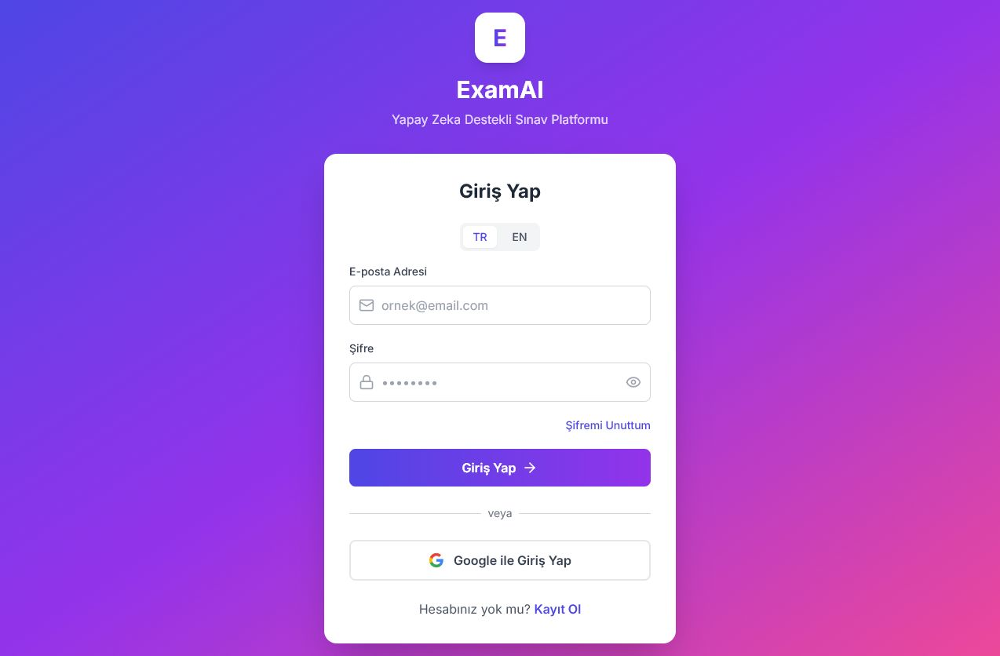
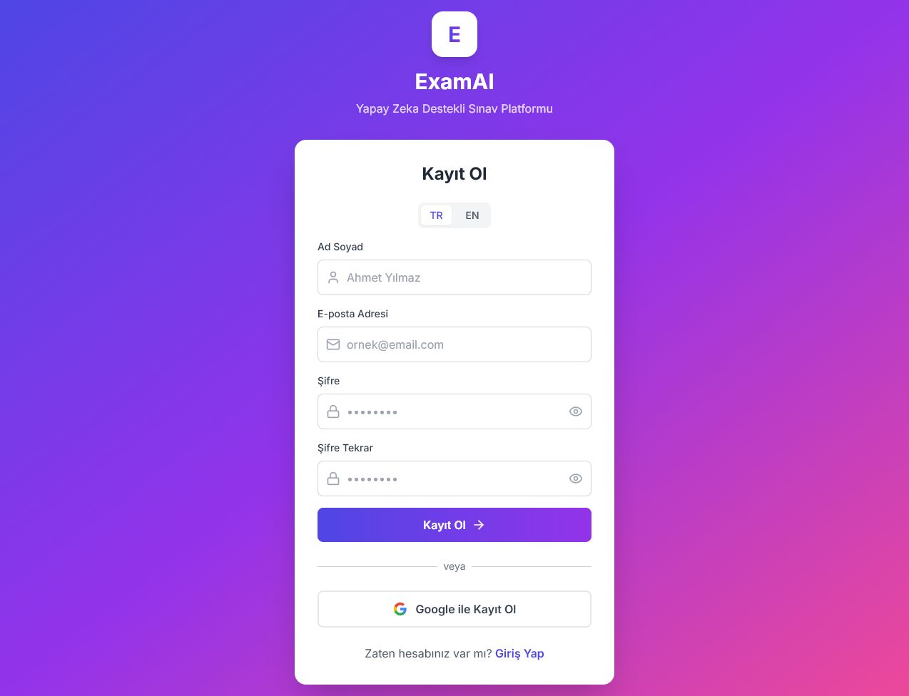
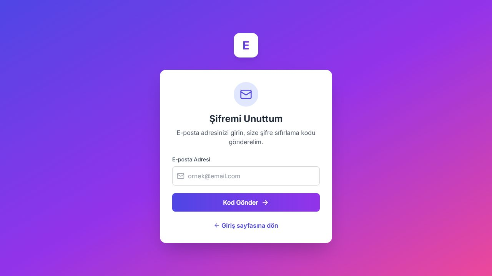

# ExamAI

ExamAI, ders notlarınızı yükleyip bunları yapay zeka destekli kişiselleştirilmiş sınavlara dönüştüren bir web uygulamasıdır. Amaç, çalışma sürecini tek bir ekranda toplamak ve not yükleme, sınav oluşturma, sınav çözme, sonuç inceleme ve PDF olarak dışa aktarma adımlarını kolaylaştırmaktır.

Bu README, bir özet niteliğindedir. Uygulamayı nasıl kuracağınızı, nasıl kullanacağınızı ve Gemini API key'i nasıl alacağınızı adım adım açıklar.

Canlı giriş bağlantısı: [https://exam-ai-xi.vercel.app/login](https://exam-ai-xi.vercel.app/login)

<a id="project-demo"></a>
## Project Demo

[](https://exam-ai-xi.vercel.app/login)

Canlı sürümü denemek için doğrudan giriş ekranını kullanabilirsiniz. Uygulamanın temel akışı burada başlar: giriş yapma, kayıt olma, şifre sıfırlama ve ardından ana panelde not yükleyip sınav oluşturma.

<a id="tech-stack"></a>
## Tech Stack

[](https://react.dev/)
[](https://vitejs.dev/)
[](https://fastapi.tiangolo.com/)
[](https://www.postgresql.org/)
[](https://redis.io/)
[](https://www.docker.com/)
[](https://ai.google.dev/)

<a id="ekran-goruntuleri"></a>
## Ekran Görüntüleri

### Giriş Ekranı



### Kayıt Ekranı



### Şifre Sıfırlama Ekranı



## İçindekiler

1. [Project Demo](#project-demo)
2. [Tech Stack](#tech-stack)
3. [Ekran Görüntüleri](#ekran-goruntuleri)
4. [Proje Hakkında](#proje-hakkinda)
5. [Öne Çıkan Özellikler](#one-cikan-ozellikler)
6. [Kimler İçin Uygun](#kimler-icin-uygun)
7. [Gereksinimler](#gereksinimler)
8. [Hızlı Başlangıç](#hizli-baslangic)
9. [Ortam Dosyaları](#ortam-dosyalari)
10. [Gemini API Key Nasıl Alınır](#gemini-api-key-nasil-alinir)
11. [Uygulama Nasıl Kullanılır](#uygulama-nasil-kullanilir)
12. [Sık Sorulan Sorular](#sik-sorulan-sorular)
13. [Güvenlik Notları](#guvenlik-notlari)

<a id="proje-hakkinda"></a>
## Proje Hakkında

ExamAI ile şunları yapabilirsiniz:

- Ders notlarınızı yükleyebilirsiniz.
- Bu notlardan otomatik sınav oluşturabilirsiniz.
- Sınavları çözebilir, sonuçları ve geri bildirimleri görebilirsiniz.
- Geçmiş sınavlarınızı takip edebilirsiniz.
- Sonuçları PDF olarak indirebilirsiniz.
- Hesap, dil, tema ve Gemini ayarlarınızı yönetebilirsiniz.

Uygulama, öğrenciler ve sınava hazırlanan herkes için tasarlanmıştır. Yüklediğiniz içerikler hesabınızla ilişkilendirilir ve yalnızca kendi kullanımınıza yönelik sunulur.

<a id="one-cikan-ozellikler"></a>
## Öne Çıkan Özellikler

- PDF, DOCX, TXT, JPG, JPEG ve PNG dosyalarını yükleme
- Yapay zeka ile otomatik sınav oluşturma
- Test ve klasik soru dengesini seçebilme
- Soru sayısı, zorluk seviyesi ve dil seçimi yapabilme
- Sınav çözme ve sonuçları görme
- Sonuçları PDF olarak indirme
- Geçmiş sınavları ve temel analizleri görüntüleme
- Kayıt olma, giriş yapma ve Google ile giriş desteği
- Şifre sıfırlama desteği
- Profil ekranından Gemini API key ve model yönetimi
- Türkçe ve İngilizce arayüz desteği
- Açık ve koyu tema desteği

Dosya yüklerken pratik sınırlar:

- En fazla 10 dosya yükleyin.
- Dosya başına yaklaşık 20 MB sınırını geçmeyin.
- Desteklenmeyen bir format seçerseniz uygulama sizi uyarır.

<a id="kimler-icin-uygun"></a>
## Kimler İçin Uygun

- Sınavlara hazırlanan öğrenciler
- Konu tekrarını hızlandırmak isteyenler
- Ders notlarını hızlıca soruya dönüştürmek isteyen öğretmenler
- Düzenli tekrar yapan ve ilerlemesini takip etmek isteyen kullanıcılar

<a id="gereksinimler"></a>
## Gereksinimler

- Windows 10/11 veya benzeri bir masaüstü ortamı
- Python 3.11 veya daha yeni bir sürüm
- Node.js 18 veya daha yeni bir sürüm
- Docker Desktop
- Google hesabı, Gemini API key almak için
- İsteğe bağlı olarak SMTP hesabı, şifre sıfırlama e-postaları için
- Görsel yüklemeyi yerelde yoğun kullanacaksanız Tesseract kurulumu faydalı olabilir

<a id="hizli-baslangic"></a>
## Hızlı Başlangıç

Bu bölümde ana akış, repo içindeki `backendWindsurf2` ve `examai-frontend` klasörleri üzerinden anlatılır.

1. Ortam dosyalarınızı hazırlayın. `backendWindsurf2/.env.example` dosyasını `backendWindsurf2/.env` olarak kopyalayın. Frontend için yerelde `examai-frontend/.env.local` dosyası oluşturup `VITE_API_URL=http://localhost:8000` yazın. Canlı sürüm için `examai-frontend/.env.production` içindeki değeri kontrol edebilirsiniz.

2. Gerekli bağımlılıkları kurun.

```powershell
cd backendWindsurf2
python -m venv .venv
.venv\Scripts\Activate.ps1
pip install -r requirements.txt

cd ..\examai-frontend
npm install
```

3. PostgreSQL ve Redis servislerini başlatın.

```powershell
cd ..\backendWindsurf2
docker compose -f docker-compose-infra.yml up -d
```

4. İlk kurulumda veritabanı tablolarını oluşturun.

```powershell
alembic upgrade head
```

5. Uygulamayı başlatın.

Windows kullanıyorsanız repo kökünde bulunan `start_all.bat` dosyası en kolay seçenektir. Bu dosya backend, arka plan görevleri, veritabanı servisleri ve frontend'i birlikte açar.

6. Tarayıcıdan uygulamayı açın.

- Frontend: `http://localhost:5173`
- Backend sağlığı: `http://localhost:8000/health`
- API dokümantasyonu: `http://localhost:8000/docs`

> **Not:** `start_all.bat` çalışmadan önce Docker Desktop açık olmalı ve temel bağımlılıklar kurulmuş olmalıdır.

<a id="ortam-dosyalari"></a>
## Ortam Dosyaları

Aşağıdaki değişkenler en önemli ayarlardır. Örnek değerleri `backendWindsurf2/.env.example` ve `backendWindsurf2/.env.production.example` içinde bulabilirsiniz.

| Değişken | Ne İçin Kullanılır | Zorunlu |
| --- | --- | --- |
| `DATABASE_URL` | PostgreSQL bağlantısı | Evet |
| `REDIS_URL` | Arka plan işlemleri ve önbellek | Evet |
| `GEMINI_API_KEY` | Yapay zeka ile sınav üretimi ve içerik işleme | Evet, önerilir |
| `GEMINI_MODEL` | Varsayılan Gemini modeli | Hayır |
| `VITE_API_URL` | Frontend'in bağlanacağı backend adresi | Evet |
| `FRONTEND_URL` | E-posta yönlendirmeleri ve Google giriş dönüşleri | Evet |
| `GOOGLE_CLIENT_ID` | Google ile giriş | Hayır |
| `GOOGLE_CLIENT_SECRET` | Google ile giriş | Hayır |
| `SMTP_HOST` | Şifre sıfırlama e-postaları | Hayır |
| `SMTP_PORT` | Şifre sıfırlama e-postaları | Hayır |
| `SMTP_USER` | Şifre sıfırlama e-postaları | Hayır |
| `SMTP_PASSWORD` | Şifre sıfırlama e-postaları | Hayır |
| `NOTE_ENCRYPTION_KEY` | Yüklenen notların güvenli saklanması | Evet |
| `SECRET_KEY` | Oturum ve güvenlik ayarları | Evet |

<a id="gemini-api-key-nasil-alinir"></a>
## Gemini API Key Nasıl Alınır

Resmi kılavuz: [Google Gemini API key dokümanı](https://ai.google.dev/gemini-api/docs/api-key)

1. Google hesabınızla Google AI Studio'ya giriş yapın.
2. Yeni kullanıcıysanız, şartları kabul ettikten sonra size bir başlangıç projesi ve key oluşturulabilir.
3. Daha önce bir Google Cloud projeniz varsa, AI Studio'da bu projeyi içe aktarmanız gerekebilir.
4. Dashboard içindeki `Projects` bölümüne gidin.
5. Gerekirse `Import projects` ile kendi projenizi ekleyin.
6. `API Keys` sayfasından `Create API key` ile yeni bir anahtar oluşturun.
7. Anahtarı kopyalayın.
8. Anahtarı `backendWindsurf2/.env` içindeki `GEMINI_API_KEY` alanına yapıştırın.
9. Uygulamayı yeniden başlatın.
10. Profil menüsünden anahtarınızı girip doğrulama işlemini yapın, ardından kaydedin.

İpucu:

- Resmi dokümantasyon `GEMINI_API_KEY` veya `GOOGLE_API_KEY` ortam değişkenlerini kullanmanızı önerir. Bu proje `GEMINI_API_KEY` alanını kullanır.
- Anahtarınızı kimseyle paylaşmayın ve GitHub'a commit etmeyin.
- Eğer `Create API key` düğmesi pasif görünüyorsa, proje izinlerinizi kontrol etmeniz veya kendi kişisel Google Cloud projenizi kullanmanız gerekebilir.

<a id="uygulama-nasil-kullanilir"></a>
## Uygulama Nasıl Kullanılır

1. Kayıt olun veya mevcut hesabınızla giriş yapın.
2. İsterseniz Google ile giriş seçeneğini kullanın.
3. Profil menüsüne girin, Gemini API key'inizi ekleyin ve doğrulayın.
4. Ders notlarınızı yükleyin.
5. Yeni sınav oluşturma ekranında istediğiniz sınav ayarlarını seçin.
6. Sınav oluşturma işlemi tamamlanana kadar bekleyin. İşlem arka planda devam eder.
7. Sınav hazır olduğunda çözmeye başlayın.
8. Sonuç ekranında puanınızı, durumunuzu ve geri bildirimleri inceleyin.
9. İsterseniz sonuçları PDF olarak indirin.
10. Geçmiş sınavlarınızı, kategorilerinizi ve analizlerinizi Dashboard üzerinden takip edin.

Ek kullanıcı özellikleri:

- Profil ekranından ad ve e-posta bilgilerinizi güncelleyebilirsiniz.
- Tema değiştirebilirsiniz.
- Arayüz dilini Türkçe veya İngilizce yapabilirsiniz.
- Şifrenizi değiştirebilir veya unuttuysanız sıfırlayabilirsiniz.

<a id="sik-sorulan-sorular"></a>
## Sık Sorulan Sorular

**Sınav neden oluşturulmuyor?**  
Genellikle Gemini API key eksik olduğu, backend çalışmadığı veya Redis servisinin açık olmadığı durumlarda olur. Profilde anahtarınızı doğrulayın ve servisleri yeniden başlatın.

**Dosya yükleme neden reddedildi?**  
Dosya formatı desteklenmiyor olabilir veya dosya boyutu sınırı aşılmış olabilir. PDF, DOCX, TXT, JPG, JPEG ve PNG kullanın.

**Google ile giriş neden çalışmıyor?**  
`GOOGLE_CLIENT_ID`, `GOOGLE_CLIENT_SECRET` ve yönlendirme adresi ayarlarını kontrol edin. Yerelde geri dönüş adresi genellikle `http://localhost:8000/api/v1/auth/google/callback` olur.

**Şifre sıfırlama e-postası gelmiyor.**  
SMTP ayarlarınızı kontrol edin. Gmail kullanıyorsanız uygulama şifresi gerekebilir.

**PDF sonuç indirme düğmesi görünmüyor.**  
Genellikle sınav sonuçları henüz hazır olmadığında görünmez. Sonucun tamamlanmasını bekleyin.

<a id="guvenlik-notlari"></a>
## Güvenlik Notları

- Gerçek `.env` dosyanızı GitHub'a yüklemeyin.
- `README.md` içinde sadece örnek değerler kullanın.
- API key ve şifreleri ekran görüntülerinde paylaşmayın.
- Yerel kullanım ile canlı kullanım için ayrı anahtarlar kullanmanız önerilir.
- Canlıya geçerken backend ve frontend adreslerini kendi alan adınıza göre güncelleyin.

---

ExamAI, düzenli tekrar yapmak ve notlardan hızlıca sınav üretmek isteyen kullanıcılar için hazırlanmıştır. İsterseniz bu README'ye bir ekran görüntüsü bölümü veya canlı demo bağlantısı da ekleyebilirsiniz.
